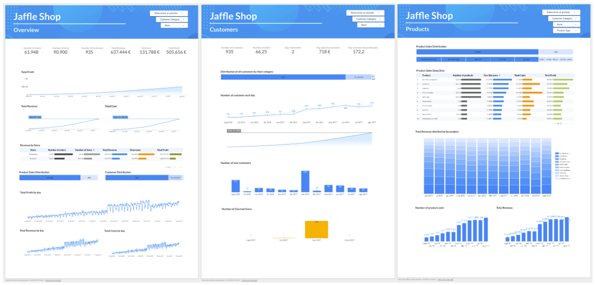
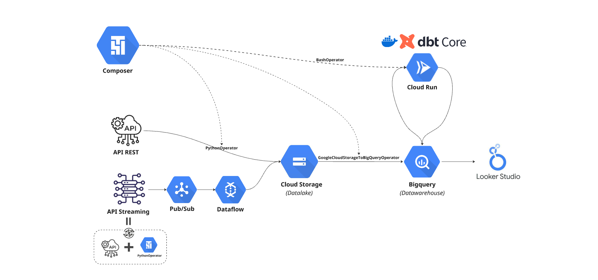
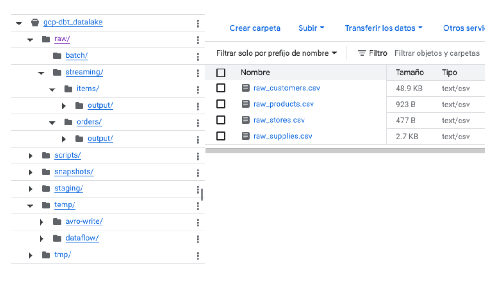
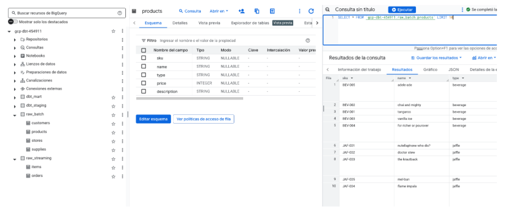
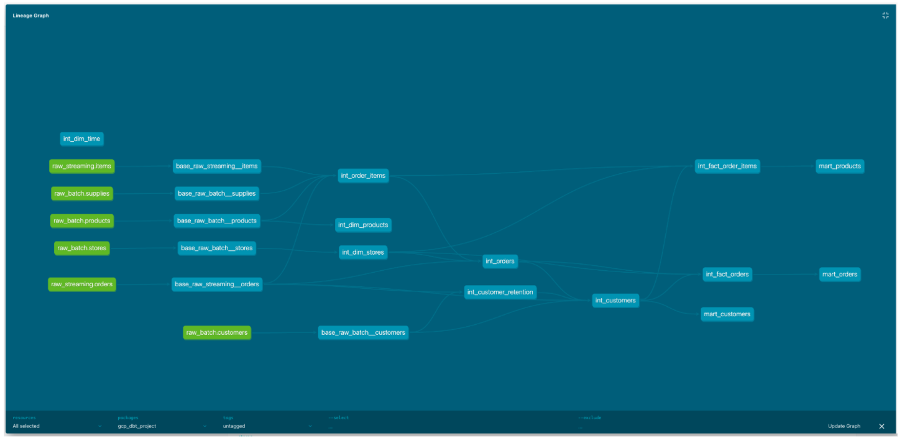
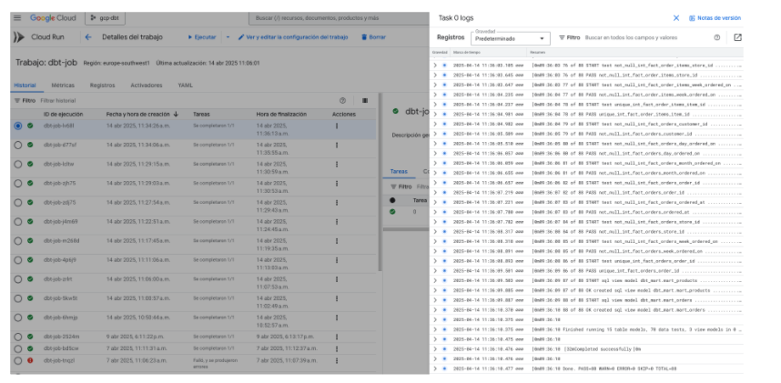
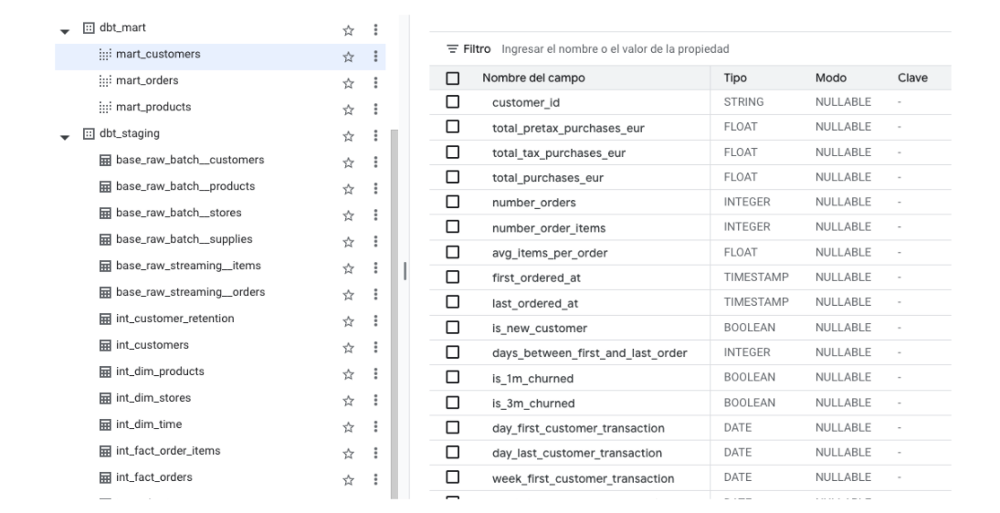
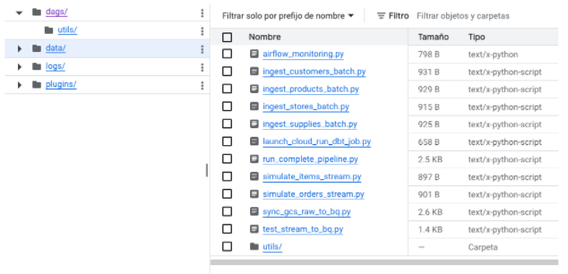
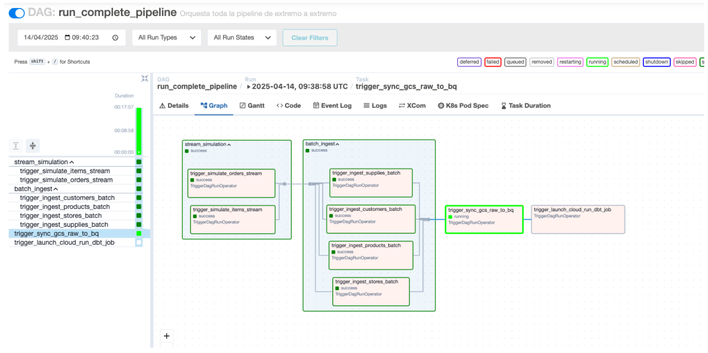

# gcp-dbt



<br></br>
<p align="center">
    
    
</p>
<br></br>

## Overview

**gcp-dbt** showcases a complete, production-grade data pipeline architecture fully deployed on GCP. It simulates ingestion from REST and Streaming APIs, stores raw data in Cloud Storage (as a datalake), transforms it with dbt Core running on Cloud Run, and loads it into BigQuery. The pipeline is orchestrated with Cloud Composer, and the results are visualized in Looker Studio.

## Problem Statement

Many teams struggle to deploy modular, scalable data pipelines that follow best practices across cloud services. This project aims to provide a hands-on, reproducible template that solves this challenge using native GCP services and dbt for transformations.

## Technologies

- **Cloud Storage**: Raw datalake and temp/log layers
- **Pub/Sub**: Streaming ingestion from simulated APIs
- **Dataflow**: Real-time event processing
- **BigQuery**: Data warehouse and dbt destination
- **Cloud Composer**: Full DAG orchestration (Airflow)
- **Cloud Run**: Executes dockerized dbt Core jobs
- **Looker Studio**: Data visualization layer


## Project Structure
```bash
gcp-dbt/
│
├── dags/
│   ├── utils/                         # DAG helper functions
│   ├── ingest_*.py                    # Batch ingestion
│   ├── simulate_*.py                  # Streaming simulation
│   ├── launch_cloud_run_dbt_job.py    # Trigger dbt job
│   └── sync_gcs_raw_to_bq.py          # GCS to BQ loader
│
├── data/                              # Source CSVs
│   ├── raw_customers.csv
│   └── ...
│
├── dbt/
│   └── gcp_dbt_project/              # dbt project (jaffle_shop fork)
│       ├── models/
│       ├── macros/
│       └── ...
│
├── notebooks/
│   └── api_testing.ipynb              # Test batch ingestion
│
├── scripts/                           # Extra tools
├── img/                               # Images for README
├── Dockerfile                         # dbt docker image
├── requirements.txt
├── environment.yml
├── README.md
└── .gitignore
```

## Workflow



### 1. Data Simulation

- Based on the [dbt Jaffle Shop](https://github.com/dbt-labs/jaffle_shop) project
- Batch data (CSV) simulates a REST API
- Streaming data is published to Pub/Sub topics via DAGs

### 2. Ingestion Layer
- **Batch**: CSVs loaded to Cloud Storage via Airflow `PythonOperator`
- **Streaming**: Simulated events published via Composer and processed with Dataflow to AVRO in Cloud Storage

```bash
gcloud dataflow jobs run stream-items-to-gcs \
  --gcs-location gs://dataflow-templates-{{REGION}}/latest/Cloud_PubSub_to_Avro \
  --region {{REGION}} \
  --max-workers 5 \
  --num-workers 2 \
  --staging-location gs://{{PROJECT_ID}}_datalake/tmp/dataflow/ \
  --enable-streaming-engine \
  --additional-experiments enable_streaming_engine,streaming_mode_exactly_once \
  --parameters inputTopic=projects/{{PROJECT_ID}}/topics/items-stream,\
outputDirectory=gs://{{PROJECT_ID}}_datalake/raw/streaming/items/output/,\
outputFilenamePrefix=output,\
avroTempDirectory=gs://{{PROJECT_ID}}_datalake/tmp/avro-write/,\
outputShardTemplate=W-P-SS-of-NN
```

### 3. Raw Storage (Datalake)
Cloud Storage organizes raw/streaming/batch data by folder

Also used for temp files, logs, backups and Composer code bucket



### 4. BigQuery Loading

Bigquery will work as Datawarehouse of the project.
- DAGs use GoogleCloudStorageToBigQueryOperator to load raw AVRO/CSV data
- Tables created in raw_* datasets with standard schema.
- Staging and Mart dbt models will be also storage in their respective schemas.
- To create the databases and ensure proper storage:

```bash
bq mk --dataset --location={{REGION}} {{PROJECT_ID}}:raw_streaming
bq mk --dataset --location={{REGION}} {{PROJECT_ID}}:raw_batch
bq mk --dataset --location={{REGION}} {{PROJECT_ID}}:dbt_staging
bq mk --dataset --location={{REGION}} {{PROJECT_ID}}:dbt_mart
```



### 5. dbt Core Transformations

1. Install dbt Core locally for dev:

```bash
pip install dbt-bigquery
```




2. Build and push Docker image:

```bash
docker buildx build --platform linux/amd64 \
  -t {{REGION}}-docker.pkg.dev/{{PROJECT_ID}}/dbt-repo/dbt-image:latest \
  --push .
```
3. Deploy Cloud Run job:
```bash
gcloud run jobs deploy dbt-job \
  --image={{REGION}}-docker.pkg.dev/{{PROJECT_ID}}/dbt-repo/dbt-image:latest \
  --region={{REGION}} \
  --project={{PROJECT_ID}} \
  --cpu=1 \
  --memory=512Mi \
  --max-retries=1 \
  --execution-environment=gen2 \
  --service-account=cloud-run-dbt-sa@{{PROJECT_ID}}.iam.gserviceaccount.com \
  --command="sh" \
  --args="-c","dbt clean --profiles-dir /app/profiles && dbt deps --profiles-dir /app/profiles && dbt build --profiles-dir /app/profiles"
```

4. Test job execution manually:
```bash
gcloud run jobs execute dbt-job \
  --region={{REGION}} \
  --project={{PROJECT_ID}}
```





### 6. Orchestration with Composer
Cloud Composer triggers:
- Streaming + batch simulators
- Data ingestion DAGs
- dbt build jobs on Cloud Run
All DAGs are stored in a dedicated Cloud Storage bucket
To create the Composer env, enable the API and:
```
gcloud composer environments create composer-env \
  --location {{REGION}} \
  --image-version composer-2.1.5-airflow-2.5.1
```





### 7. Dashboarding in Looker Studio
Final mart_* tables in BigQuery are connected to Looker
- Store-level metrics
- Product insights
- Customer behavior


